# Awesome Ortholinear Keyboards 

- [15x5](#15x5)
  - [ID75](#id75)
  - [XD75](#xd75)
- [12x5](#12x5)
  - [Preonic](#preonic)
  - [JJ50](#jj50)
  - [Nyquist](#nyquist)
  - [Helix](#helix)
- [12x4](#12x4)
  - [Planck](#planck)
  - [Planck EZ](#planck-ez)
  - [JJ40](#jj40)
  - [BM40](#bm40)
  - [YMD40](#ymd40)
  - [Levinson](#levinson)
- [Others](#others)
  - [BFO-9000](#bfo-9000)
- [Ortholinear Keycaps](#ortholinear-keycaps)
- [Uniform Profile Keycaps](#uniform-profile-keycaps)
- [Full-Size Keyboard Set](#full-size-keyboard-set)
- [Use blanks for modifiers](#use-blanks-for-modifiers)

## 15x5

**75 keys** - enough keys for all of the symbols and the arrow cluster, as well as a full-size numpad. Can also convert to a split layout by placing the numpad (or other keys) in the center.

### ID75

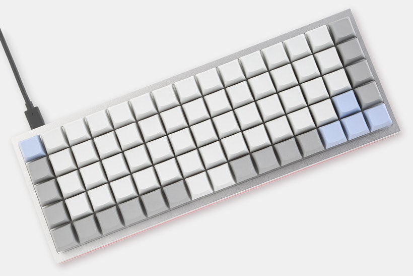

_(image: https://www.tryorthokeys.com/id75)_

- Hot-swappable: Y
- Connection: USB-C
- Additional features
  - Bottom lit LEDs
- Links
  - https://idobao.net/products/idobao-id75v1-hot-swappable-mechanical-keyboard-kit
  - https://www.tryorthokeys.com/id75

### XD75

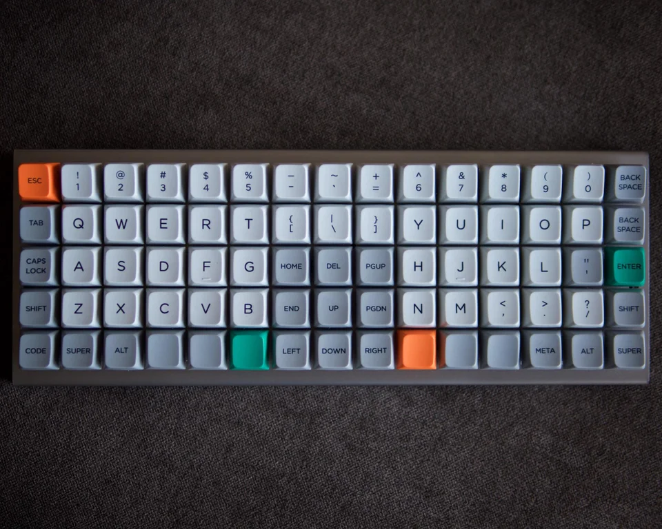

_(image: https://redd.it/ccr3gc)_

- Hot-swappable: Y
- Connection: USB-C
- Links
  - https://kprepublic.com/collections/xd75

## 12x5

**60 keys** - enough keys to cover most of the symbols. The lower and raise layers can be used to deal with missing keys.

### Preonic

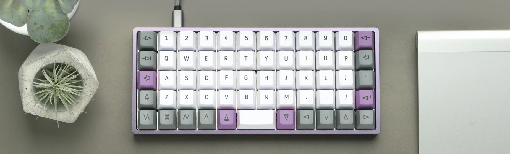

_(image: https://drop.com/buy/preonic-mechanical-keyboard)_

- Hot-swappable: Y
- Connection: USB-C
- Additional features
  - Speaker
  - Bottom-lit LEDs
  - Rotary encoder support
  - Footprint for DIP switches, power adapter plugs and Qwiic connectors
- Links
  - https://www.tryorthokeys.com/olkb
  - https://drop.com/buy/preonic-mechanical-keyboard

### JJ50

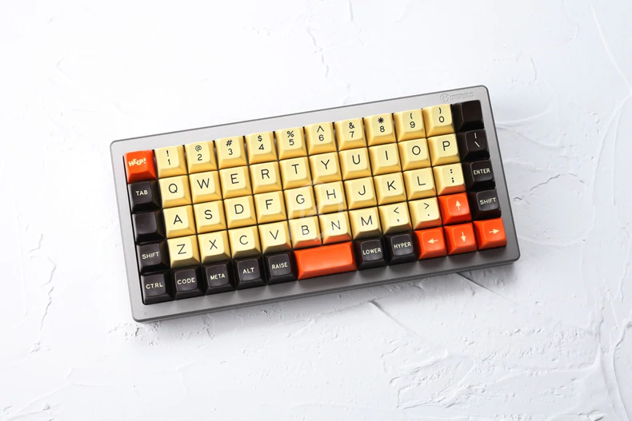

_(image: https://kprepublic.com/collections/jj50-50)_

- Hot-swappable: N
- Connection: Micro USB
- Links
  - https://kprepublic.com/collections/jj50-50

### Nyquist

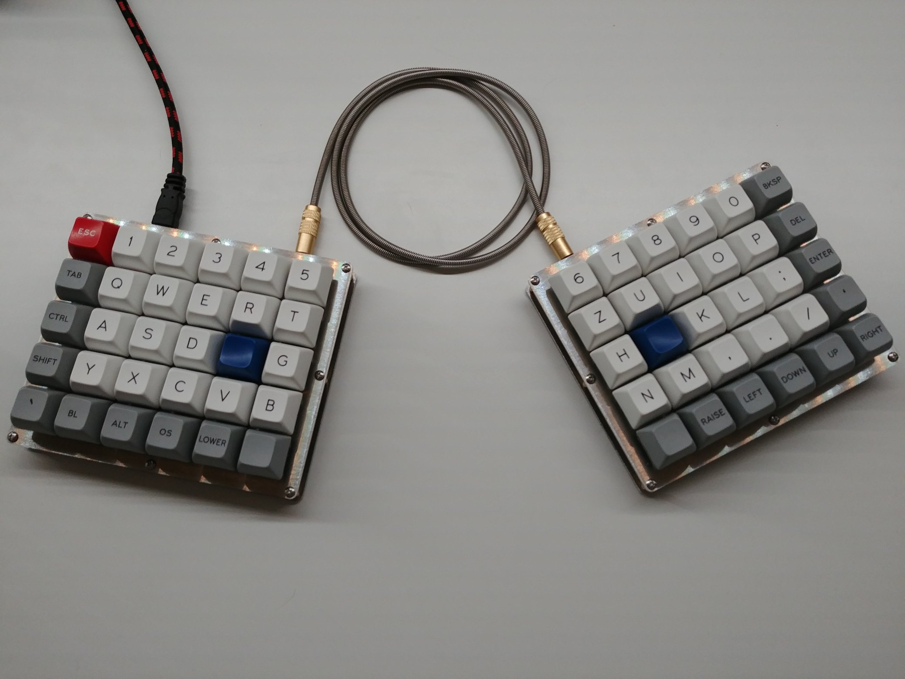

_(image: https://twitter.com/martyschaer/status/960277109406134274)_

- Hot-swappable: N
- Connection: USB-C
- Additional features
  - Split layout
  - Bottom row can be broken off to make it a 40%
- Links
  - https://keeb.io/collections/frontpage/products/nyquist-keyboard

### Helix

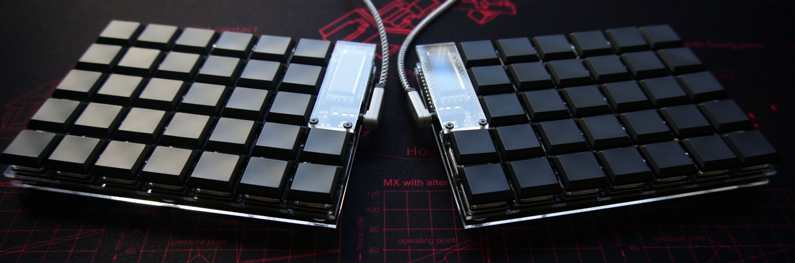

_(image: https://github.com/MakotoKurauchi/helix)_

- Hot-swappable: Y
- Connection: _depends the MCU_ / TRRS for connecting the half
- Additional features
  - Split layout
  - Additional 2 keys on each side (30+2 = 32 / total: 64 keys)
  - Support OLED screens
- Links
  - https://github.com/MakotoKurauchi/helix

## 12x4

**48 keys** - 12x5 but minus the number row.

### Planck

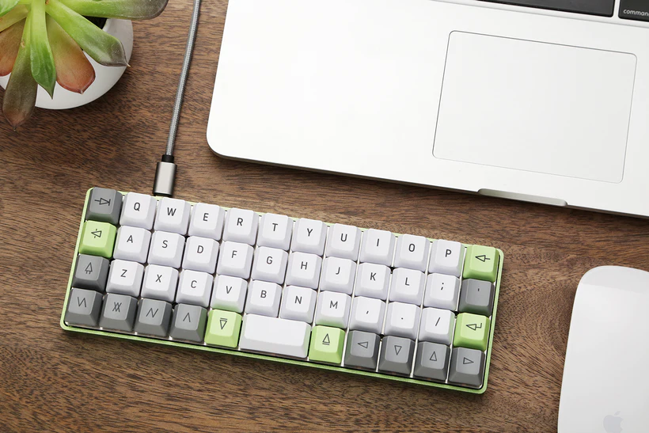

_(image: https://drop.com/buy/planck-mechanical-keyboard)_

- Hot-swappable: Y
- Connection: USB-C
- Links
  - https://www.tryorthokeys.com/olkb
  - https://drop.com/buy/planck-mechanical-keyboard

### Planck EZ

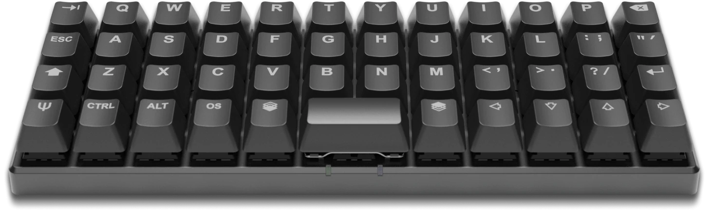

_(image: https://ergodox-ez.com/pages/planck)_

- Hot-swappable: Y
- Connection: USB-C
- Additional features
  - 47 keys - limited to only single 2U space in the center
- Links
  - https://www.zsa.io/planck/
  - Comparison with Planck: https://ergodox-ez.com/pages/planck-ez-vs-olkb-planck

### JJ40

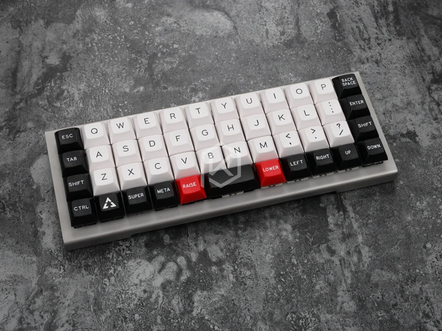

_(image: https://kprepublic.com/collections/daisy-40)_

- Hot-swappable: N
- Connection: Micro USB
- Links
  - https://kprepublic.com/collections/daisy-40

### BM40

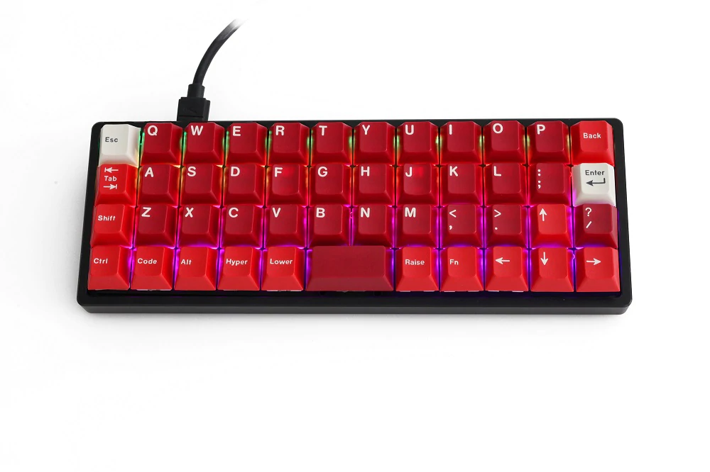

_(image: https://kprepublic.com/products/bm40-rgb-40-hot-swap-custom-mechanical-keyboard-pcb-qmk-underglow-type-c-planck)_

- Hot-swappable: Y
- Connection: USB-C
- Additional features
  - 47 keys - limited to only single 2U space in the center
  - RGB underglow
- Links
  - https://kprepublic.com/products/bm40-rgb-40-hot-swap-custom-mechanical-keyboard-pcb-qmk-underglow-type-c-planck

### YMD40

- Hot-swappable: N
- Connection: USB-C
- Links
  - https://ymdkey.com/products/ymd40-v2-diy-kit-qmk-type-c-pcb-cnc-case-plate-for-40-mini-cute-mechanical-keyboard-similar-to-planck-layout

### Levinson

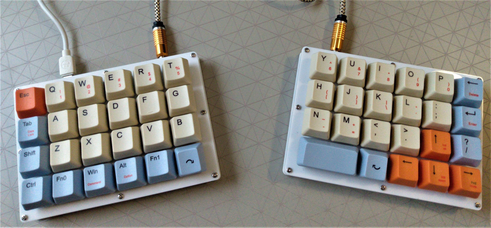

_(image: https://redd.it/kp1a5c)_

- Hot-swappable: N
- Connection: _depends the MCU_
- Additional features
  - Split layout
- Links
  - https://keeb.io/collections/frontpage/products/nyquist-keyboard

## Others

### BFO-9000

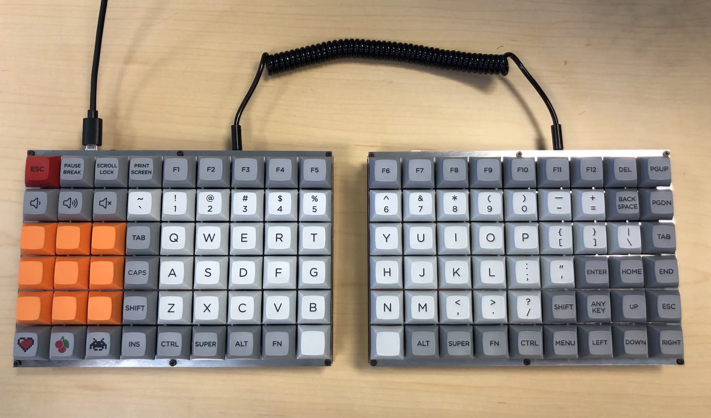

_(image: https://redd.it/8wl1b7)_

- Hot-swappable: N
- Connection: _depends the MCU_
- Additional features
  - 108 keys
  - PCB can be broken off for 4-6 rows and 7-9 columns
- Links
  - https://keeb.io/products/bfo-9000-keyboard-customizable-full-size-split-ortholinear

# Awesome Ortholinear Keycaps

Finding a **non-blank** ortholinear keycap set can be challenging because there aren't enough 1U modifiers in a small set. The following content will assist you in finding a set that matches yours. This is not meant to be an exhaustive list, but rather a starting point for your ideal set.

## Ortholinear Keycaps

Surprisingly there're specifically sets that made for ortho keyboards. Surely, there will be enough 1U modifiers and spacebar for your board.

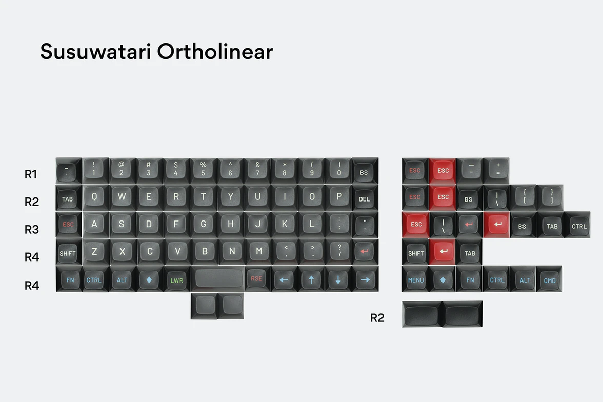

_(image: https://drop.com/buy/drop-matt3o-mt3-susuwatari-custom-keycap-set)_

- Most **MT3** profile set will offers ortholinear option.
- Some **XDA** and **DSA** set will offers ortholinear option.

## Uniform Profile Keycaps

Uniform profile such as XDA and DSA means that all caps will be in the same height which enable us to use the unused caps from other row in place of the modifiers.

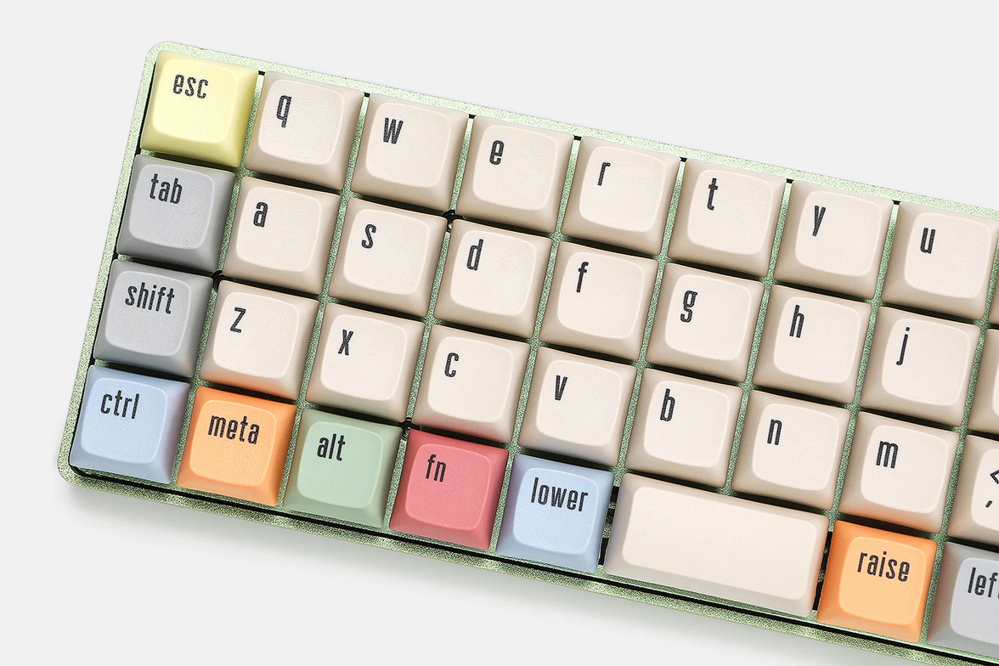

_(image: https://drop.com/buy/massdrop-x-mito-canvas-xda-custom-keycap-set)_

- **DSA** and **XDA** are the most common uniform profile while the **KAM** and **ADA** are rarer.
- Same height also means that the alpha caps can be switched across the row. So, there is no addon set required for alternative layout user such as AZERTY, Dvorak, Colemak, etc.
- Feel free to compare the profile height at https://www.keycaps.info/

## Full-Size Keyboard Set

Sets that are made for 108 keys full-size keyboard will surely have a spare for your ortho but with mismatch legends.

## Use blanks for modifiers

If your favorite profile or colorway does not comes with the above mentioned options. You can just buy blanks to fill in the currently "blank" modifiers.
